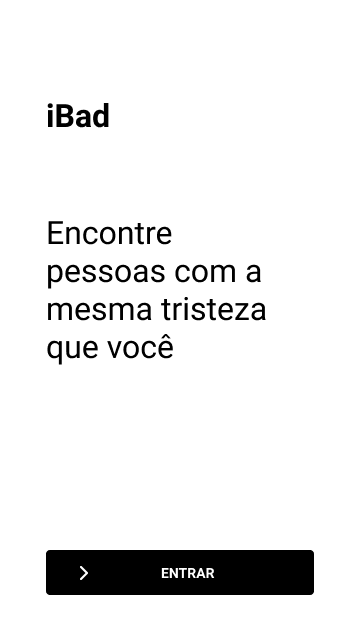
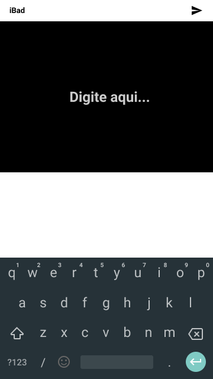
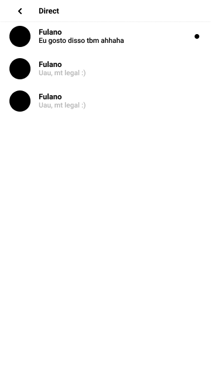

# iBadMobile
## Este projeto ainda está em desenvolvimento

 

# Run
- Você procisa rodar o servidor primeiramente https://github.com/GuilhermeGabriel/iBadServer
- Depois para rodar o mobile, baixe o Expo app

```
// Baixe o repositório
git clone git@github.com:GuilhermeGabriel/iBadMobile.git

//Entre na pasta
cd iBadMobile

//Baixe as dependencias
yarn

//Rode o mobile
yarn start
```
